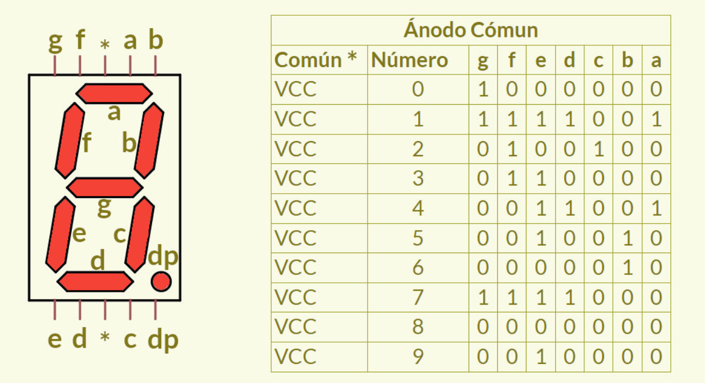
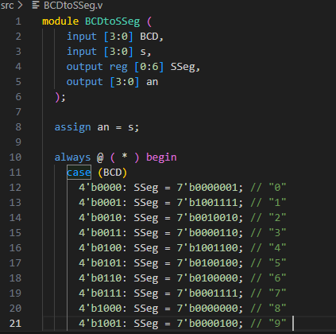
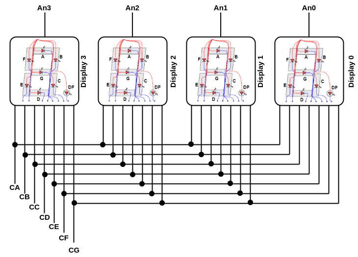
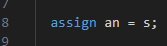

# Lab03: Decodificador BCD a 7segmentos

## Integrantes 

[Juan Esteban Rodriguez Marin](https://github.com/Esteban-dido)
[Luis Fernando Montenegro Silva](https://github.com/luisfer13672)

## Informe

Indice:

1. [Diseño implementado](#1-diseño-implementado)
2. [Descripción](#2-descripción)
3. [Implementación](#3-diagramas)
4. [Simulaciones](#4-simulaciones)
5. [Implementación](#5-implementación)
6. [Conclusiones](#conclusiones)

## 1. Diseño implementado

| Dígito Decimal | BCD (4 bits) | Hexadecimal |
|----------------|-------------|-------------|
|       0        |    0000     |      0      |
|       1        |    0001     |      1      |
|       2        |    0010     |      2      |
|       3        |    0011     |      3      |
|       4        |    0100     |      4      |
|       5        |    0101     |      5      |
|       6        |    0110     |      6      |
|       7        |    0111     |      7      |
|       8        |    1000     |      8      |
|       9        |    1001     |      9      |
|      10        |    1010     |      A      |
|      11        |    1011     |      B      |
|      12        |    1100     |      C      |
|      13        |    1101     |      D      |
|      14        |    1110     |      E      |
|      15        |    1111     |      F      |

Ahora bien, también es posible representar de forma binaria los números décimales del 10 al 15 pero empleando su correspondiente representación en el sistema hexadécimal como se muestra en la tabla.

El display de siete segmentos es un dispositivo electrónico que consta de siete diodos emisores de luz (LED) dispuestos en un patrón definido; encender una combinación particular de éstos permite representar un dígito décimal o hexadécimal Existen dos tipos de display LED de siete segmentos:

Tipo de cátodo común: en este tipo de display, todos los cátodos de los siete LEDs están conectados entre sí a tierra o −Vcc
 (por lo tanto, cátodo común) y el LED muestra dígitos cuando se suministra un nivel alto a los ánodos individuales.

Tipo de ánodo común: en este tipo de display, todos los ánodos de los siete LEDs están conectados a 
+Vcc
 (por lo tanto, ánodo común) y el LED muestra dígitos cuando se suministra un nivel al bajo a los cátodos individuales.

En las siguientes figuras se muestra cómo se distribuyen los 7 segmentos en el display cuando se tiene una configuración de ánodo común:

Este codigo fue proporcionado por la profesora, inicialmente para mostrarnos como funcionaba como era la codificación hacia la FPGA y luego la decodificación en el display 7 segmentos, sin embargo este codigo mostraba unicamente la decodificación en el primer 7 segmentos disponible en la FPGA. 

Como se ve en esta imagen, la FPGA tiene 4 displays 7 segmentos, correspondia a nosotros hacer que estos se activaran segun una señal de control, nosotros agregamos la señal de control s, conectada a los anodos de cada 7 segmentos y asi multiplexar el display solicitado

### 2. Descripción

### 3. Diagramas

## 4. Simulaciones 

## 5. Implementación

## Conclusiones

